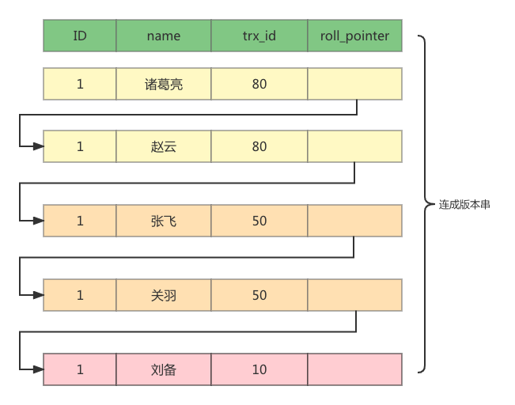

#学习总纲
## 目录
- [Java](#java)
    - [Java集合](Java集合)
    - [Java多线程](Java多线程)
    - [threadlocal](com.guce.ThreadLocalLearn)  
    - [jvm](#JVM内存结构GC算法)
    - [lock](Java锁)

- [MySQL](#MySQL)
  - [事务隔离级别](#事务隔离级别)
  - [MVCC](#MVCC)  
  - [MySQL日志文件](#MySQL日志文件)
  - [执行计划分析](#./MySQL/explain.MD)
  - 锁 间隙锁
  - 索引存储结构
  - 索引下推 索引覆盖  回表

- redis
    1. redis数据结构  string  hash  list  set zset 
    2. redis内部数据结构：实现原理
    3. redis失效策略
    4. redis缓存淘汰策略
    5. redis持久化策略  aof rdb
    6. redis如何实现分布式锁 ; 
    7. redis如何保证高性能；

- RocketMQ
    1. rocketMQ消息有哪几种
    2. rocketMQ如何保证事务
    3. rocketMQ如何实现消息不丢失
    4. 为何要使用rocketMQ
    5. rocketMQ消息消费异常如何处理
    6. rocketMQ如何保证幂等

- 网络IO
    1. poll  epoll 实现原理
- 进阶
    1. 服务器CPU飚高如何排查；
    2. 内存溢出问题如何排查 -mat 什么情况下会出现内存溢出
    3. 系统稳定性
    4. arthas
    5. spring IOC AOP
    6. Mybatis
    7. 缓存技术  
       - 缓存穿透
       - 缓存击穿 
       - 缓存雪崩
    
    8. 高可用、高性能、可扩展
    9. 接口幂等实现
    10. 唯一性ID如何生成
        - snowflakes(雪花算法)
        - 数据库实现 (步长)
    11. 负载均衡算法
        - 轮询
        - 一致性hash
        - 随机数
        - 最少使用算法
    12. 限流算法
        - 滑动窗口
        - 漏桶
        - 令牌桶
    13. 团队管理
    14. traceId解决方案
    15. 分库分表
    16. 接口：限流、降级、垄断；   
        (RateLimiter / 开关降级  / setinel)
        
    17. 分布式锁
        - redis实现分布式锁（lua脚本实现）； watchdog
        - 数据库唯一版本号
        - 数据库乐观锁(版本号)
        - zookeeper实现

## MySQL
### 事务隔离级别

MySQL 有四种事务隔离级别 `读未提交` `读已提交` ` 可重复读` `串性化` MySQL默认事务隔离方式 `可重复读`

| 事务隔离级别 | 脏读  | 不可重复读  | 幻读  |  
|--------|-----|--------|-----|
| 读未提交   | 是   | 是      | 是   |
| 读已提交   | 否   | 是      | 是   |
| 可重复读   | 否   | 否      | 是   |
| 串行化    | 否   | 否      | 否   |

- 脏读  
  `事务A`做`update`操作在事务未提交的情况下，`事务B`能 `select`出`事务A`未提交的数据；
- 不可重复读 
  - **事务A** 开始后做`update` 操作；
  - **事务B** 开始事务，`select` 此时是不会读到**事务A**的`update`；
  - **事务A** commit；
  - **事务B** 再次`select`操作，读到了**事务A**的commit；
- 幻读  
  **事务B** 能读到 **事务A** 的 `insert`操作；

### MVCC

>MySQL通过MVCC实现 `可重复读`隔离级别  

MySQL使用InnoDB存储引擎时，它的聚簇索引中包含了2个必要的隐藏列
- trx_id ： 事务ID隐藏列
- roll_pointer：对于某条聚簇索引记录每次改动时，都会把旧版本的记录写到undo log中，然后这个隐藏列就是执行该旧版本的指针；

比如我们有如下表：
```shell
mysql> SELECT * FROM t;
+----+--------+
| id | name   |
+----+--------+
|  1 | 刘备   |
+----+--------+
1 row in set (0.01 sec)
```
假设该条记录的事务ID为10； 

当发生如下操作时  

| 发生时间编号 | trx50                               | trx80                               | 
|--------|-------------------------------------|-------------------------------------|
| 1      | begin                               |                                     |
| 2      | update t set name='关羽' where id=1;  |                                     |
| 3      | update t set name='张飞' where id=1;  |                                     |
| 4      | commit                              |                                     |
| 5      |   | update t set name='赵云' where id=1;  |
| 6      |  | update t set name='诸葛量' where id=1; |
| 7      |                                     | commit                              |

此时在`undo log`中的记录应该是这样的



#### readview
readview是一种数据结构，包含如下字段：

- m_ids，当前有哪些事务正在执行，且还没有提交，这些事务的 id 就会存在这里； 
- min_trx_id，是指 m_ids 里最小的值； 
- max_trx_id，是指下一个要生成的事务 id。下一个要生成的事务 id 肯定比现在所有事务的 id 都大； 
- creator_trx_id，每开启一个事务都会生成一个 ReadView，而 creator_trx_id 就是这个开启的事务的 id。
  
判断逻辑
  从最新的版本开始判断，逻辑如下：
  - 当前版本如果比记录的所有事务id都大，即在当前事务开始的时候，该事务并未启动，所以一定不可见的。
  - 当前版本如果比记录的所有事务id都小，即在当前事务开始的时候，该事务已提交，所以可见
  - 当前版本在readview中，即在当前事务开始的时候，该事务未提交，不可见
  - 当前版本不在readview中，即在当前事务考试的时候，该事务已提交，可见
  - 更新逻辑，因为更新不可能在快照上做更新，所以更新的时候是读取最新的数据上再做修改，且因为修改之后的undo log会记录自己的事务id，所以自己再次查询也是可见的

### MySQL日志文件

MySQL包含3个日志文件 `redo log` `undo log` `bin log`

#### Redo log 的用途
为了保证数据能正确的`持久化`，在系统出现异常的时候通常会对redo log进行回放，把已经commit的事务进行数据重做。


      Redo Log记录的是新数据的备份。在事务提交前，只要将Redo Log持久化即可，不需要将数据持久化。当系统崩溃时，虽然数据没有持久化，但是Redo Log已经持久化。系统可以根据Redo Log的内容，将所有数据恢复到最新的状态。

#### Undo log 的用途

1. 保证事务进行rollback时的原子性，当事务进行回滚或者系统异常需要对数据进行回滚的的时候可以用undo log的日志进行数据重做。

2.  用于`MVCC快照读`的数据，在MVCC多版本控制中，通过读取undo log的历史版本数据可以实现不同事务版本号都拥有自己独立的快照数据版本。


      Undo Log的原理很简单，为了满足事务的原子性，在操作任何数据之前，首先将数据备份到一个地方（这个存储数据备份的地方称为Undo Log）。然后进行数据的修改。如果出现了错误或者用户执行了ROLLBACK语句，系统可以利用Undo Log中的备份将数据恢复到事务开始之前的状态。
      除了可以保证事务的原子性，Undo Log也可以用来辅助完成事务的持久化。

#### redo log 和undo log 的生成过程

        事务操作：将user表进行 update user set name = '顾彻' where id=1 

整体流程如下：
1. 在修改数据前，把需要修改的数据load到内存中；
2. 将原数据写入到undo log中；
3. 将修改后的数据写入到redo log中；
4. 当commit / rollback 时，将redo log  / undo log 中的数据修改到表中；

事务持久性的保障：
持久化性是在系统出现异常、崩溃时依然能保证我们的数据能正常持久化到数据库中，在系统出现异常或崩溃时，
我们会对redo log进行回放，对于已经commit的事务进行数据重做，对于事务没有commit的事务，我们可以通过
undo log来对事务涉及到的数据回滚从而保证事务数据的正确性；

### 执行计划分析

expain出来的信息有10列，
分别是`id`、`select_type`、`table`、`type`、`possible_keys`、`key`、`key_len`、`ref`、`rows`、`Extra`，下面对这些字段进行解释：

- id  
  执行编号，标识select所属的行。如果在语句中没子查询或关联查询，
  只有唯一的select，每行都将显示1。
  否则，内层的select语句一般会顺序编号，对应于其在原始语句中的位置

- select_type  
  显示本行是简单或复杂select。
  如果查询有任何复杂的子查询，则最外层标记为PRIMARY（DERIVED、UNION、UNION RESUlT）;

- table   
  访问引用哪个表（引用某个查询，如“derived3”）

- type  
  数据访问/读取操作类型（ALL、index、range、ref、eq_ref、const/system、NULL）

- possible_keys  
  揭示哪一些索引可能有利于高效的查找

- key  
  显示mysql决定采用哪个索引来优化查询

- key_len  
  显示mysql在索引里使用的字节数

- ref  
  显示了之前的表在key列记录的索引中查找值所用的列或常量

- rows  
  为了找到所需的行而需要读取的行数，估算值，不精确。
  通过把所有rows列值相乘，可粗略估算整个查询会检查的行数

- Extra  
  额外信息，如using index、filesort等


### id

>1. id相同时，执行顺序由上至下，内存会认为三个表，乘积小的先执行
    比如三个表：t3-t4-t5
    ：t3-t3-t4
>2. 如果是子查询，id的序号会递增，`id值越大优先级越高，越先被执行`
>3. id如果相同，可以认为是一组，从上往下顺序执行；在所有组中，id值越大，优先级越高，越先执行

```shell
mysql> explain select * from (select * from ( select * from t3 where id=123) a) b;  
+----+-------------+------------+--------+-------------------+---------+---------+------+------+-------+  
| id | select_type | table      | type   | possible_keys     | key     | key_len | ref  | rows | Extra |  
+----+-------------+------------+--------+-------------------+---------+---------+------+------+-------+  
|  1 | PRIMARY     | <derived2> | system | NULL              | NULL    | NULL    | NULL |    1 |       |  
|  2 | DERIVED     | <derived3> | system | NULL              | NULL    | NULL    | NULL |    1 |       |  
|  3 | DERIVED     | t3         | const  | PRIMARY,idx_t3_id | PRIMARY | 4       |      |    1 |       |  
+----+-------------+------------+--------+-------------------+---------+---------+------+------+-------+

```

### type

>system、const、eq_reg、ref、range、index、ALL（从左到右，性能从好到差）

- ALL  
  全表扫描

- index
  索引全表扫描

- range  
  索引范围查询

>当使用=、<>、>、>=、<、<=、IS NULL、<=>、BETWEEN或者IN操作符，用常量比较关键字列时，可以使用range

- ref  
  触发条件：
    - 触发联合索引最左原则 ;
    - 或者这个索引不是主键，也不是唯一索引（换句话说，如果这个在这个索引基础之上查询的结果多于一行）。

>在对已经建立索引列进行 = 或者 <=> 操作的时候，ref会被使用到


- eq_ref  
  和ref类似 不过  `eq_ref` 是 `主键索引`或`唯一索引`；

- const
  当MySQL对查询某部分进行优化，并转换为一个常量时，使用这些类型访问。

- system  
  当查询的表只有一行数据；


####工作中总结
1. 对于应用程序层面：保证应用一次完成的链路可以通过一个traceId查询出所有的链路；
2. 通过注解实现开关拿开关； 不会再出现各种各样的拿开关的代码
3. 使用redis实现延时队列  使用zset实现
4. 使用redis实现at least once queue
5. 对于数据库中突然某条SQL跑慢了，应该是执行计划跑偏了 ；绑定执行计划； MySQL指定索引；
6. 对于大数据量跑数据 源数据使用 ID分段 ；在分布到集群中个节点执行；

   做的业务：信用卡积分主流程；
   积分笔笔抽 ；
   *****对于恶意薅羊毛的客户实施积分账号冻结；