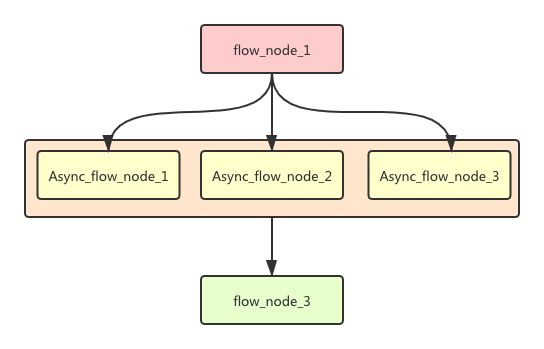

# 流程引擎框架

## 执行流程图



## 环境要求
使用环境：springboot 2.0.4 以上 ；jdk8;

## 功能介绍

使用设计模式：责任链模式

该流程引擎实现功能：`异常处理` `执行完最后执行` `异常回滚`

流程配置方式
1. 注解方式
2. 配置文件方式

流程执行方式

    
    chainExecutor.execute(${chainResourceName});

实现方式
- 注解方式

    通过注解 `@ChainService` 配置
    
        
- 配置文件方式
    
    通过配置文件 `xxxFlow.json`  配置流程
    ```json
      {
        "flowServiceName": [
      
          {
            "servicePath": "com.guce.service.impl.ChainService1",
            "order": "200",
            "isAsync" : false,
            "asyncTimeout": 1000
          },{
            "servicePath": "com.guce.service.impl.ChainService2",
            "order": 100,
            "isAsync" : false,
            "asyncTimeout": 1000
          },{
            "servicePath": "com.guce.service.impl.ChainService3",
            "order": 150,
            "isAsync" : false,
            "asyncTimeout": 1000
          },{
            "servicePath": "com.guce.service.impl.ChainService4",
            "order": 400,
            "isAsync" : false,
            "asyncTimeout": 1000,
            "isNeedNode": false
          }
        ]
      }
    ```
    注解属性说明   
        
            value：流程资源名称 同一个流程的唯一标识
            order：流程节点执行顺序
            isAsync：是否异步执行  默认为 false
            asyncTimeout:异步超时时间 配合 isAsync 来使用
            isNeedNode ：是否是必须的流程节点  默认为 true
 
 ## demo
 [流程执行demo](./../chain-framework/src/test/java/com/guce/SpringBootstrapTest.java)