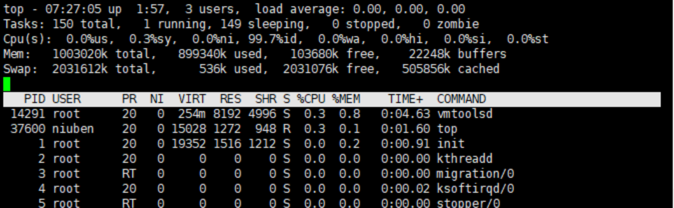

# top命令详解

- 第一行，任务队列信息，同 uptime 命令的执行结果

    系统时间：07:27:05
    运行时间：up 1:57 min,
    当前登录用户：  3 user 
    负载均衡(uptime)  load average: 0.00, 0.00, 0.00
         average后面的三个数分别是1分钟、5分钟、15分钟的负载情况。  
    load average数据是每隔5秒钟检查一次活跃的进程数，然后按特定算法计算出的数值。如果这个数除以逻辑CPU的数量，结果高于5的时候就表明系统在超负荷运转了

- 第二行，Tasks — 任务（进程）

    总进程:150 total, 运行:1 running, 休眠:149 sleeping, 停止: 0 stopped, 僵尸进程: 0 zombie
    
- 第三行，cpu状态信息

    0.0%us【user space】— 用户空间占用CPU的百分比。
    0.3%sy【sysctl】— 内核空间占用CPU的百分比。
    0.0%ni【】— 改变过优先级的进程占用CPU的百分比
    99.7%id【idolt】— 空闲CPU百分比
    0.0%wa【wait】— IO等待占用CPU的百分比
    0.0%hi【Hardware IRQ】— 硬中断占用CPU的百分比
    0.0%si【Software Interrupts】— 软中断占用CPU的百分比

- 第四行,内存状态

    1003020k total,   234464k used,   777824k free,    24084k buffers【缓存的内存量】
    
第五行，swap交换分区信息

    2031612k total,      536k used,  2031076k free,   505864k cached【缓冲的交换区总量】

>可用内存=free + buffer + cached
 对于内存监控，在top里我们要时刻监控第五行swap交换分区的used，如果这个数值在不断的变化，说明内核在不断进行内存和swap的数据交换，这是真正的内存不够用了。
 第四行中使用中的内存总量（used）指的是现在系统内核控制的内存数，
 第四行中空闲内存总量（free）是内核还未纳入其管控范围的数量。
 纳入内核管理的内存不见得都在使用中，还包括过去使用过的现在可以被重复利用的内存，内核并不把这些可被重新使用的内存交还到free中去，因此在linux上free内存会越来越少，但不用为此担心。

- 第七行以下：各进程（任务）的状态监控

    PID — 进程id
    USER — 进程所有者
    PR — 进程优先级
    NI — nice值。负值表示高优先级，正值表示低优先级
    VIRT — 进程使用的虚拟内存总量，单位kb。VIRT=SWAP+RES
    RES — 进程使用的、未被换出的物理内存大小，单位kb。RES=CODE+DATA
    SHR — 共享内存大小，单位kb
    S —进程状态。D=不可中断的睡眠状态 R=运行 S=睡眠 T=跟踪/停止 Z=僵尸进程
    %CPU — 上次更新到现在的CPU时间占用百分比
    %MEM — 进程使用的物理内存百分比
    TIME+ — 进程使用的CPU时间总计，单位1/100秒
    COMMAND — 进程名称（命令名/命令行）
    
- 查看CPU核数

    # 总核数 = 物理CPU个数 X 每颗物理CPU的核数 
    # 总逻辑CPU数 = 物理CPU个数 X 每颗物理CPU的核数 X 超线程数
    
    # 查看物理CPU个数
    cat /proc/cpuinfo| grep "physical id"| sort| uniq| wc -l
    
    # 查看每个物理CPU中core的个数(即核数)
    cat /proc/cpuinfo| grep "cpu cores"| uniq
    
    # 查看逻辑CPU的个数
    cat /proc/cpuinfo| grep "processor"| wc -l

参考：

[Linux top命令详解](https://www.cnblogs.com/niuben/p/12017242.html)   
[Spring Boot引起的“堆外内存泄漏”排查及经验总结](https://tech.meituan.com/2019/01/03/spring-boot-native-memory-leak.html)