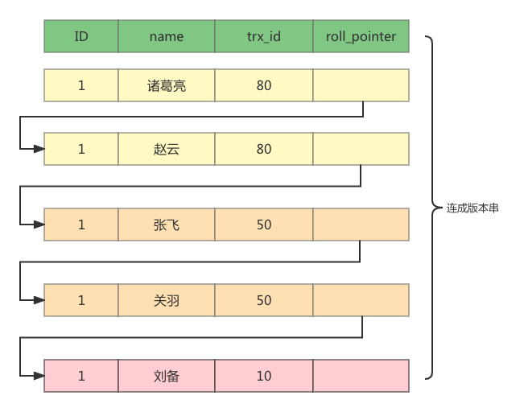

# MySQL MVCC

## MySQL 存储文件
[MySQL日志文件](./MySQL日志文件.MD)

## MVCC

> `已提交读` `可重复读` 都可以通过MVCC来实现事务隔离

MySQL使用InnoDB存储引擎时，它的聚簇索引中包含了2个必要的隐藏列
- trx_id ： 事务ID隐藏列
- roll_pointer：对于某条聚簇索引记录每次改动时，都会把旧版本的记录写到undo log中，然后这个隐藏列就是执行该旧版本的指针；

比如我们有如下表：
```shell
mysql> SELECT * FROM t;
+----+--------+
| id | name   |
+----+--------+
|  1 | 刘备   |
+----+--------+
1 row in set (0.01 sec)
```
假设该条记录的事务ID为10；

当发生如下操作时

| 发生时间编号 | trx50                               | trx80                               | 
|--------|-------------------------------------|-------------------------------------|
| 1      | begin                               |                                     |
| 2      | update t set name='关羽' where id=1;  |                                     |
| 3      | update t set name='张飞' where id=1;  |                                     |
| 4      | commit                              |                                     |
| 5      |   | update t set name='赵云' where id=1;  |
| 6      |  | update t set name='诸葛量' where id=1; |
| 7      |                                     | commit                              |

此时在`undo log`中的记录应该是这样的



### readview


当我们的隔离级别为 RR 时：每开启一个事务，系统会给该事务会分配一个事务 Id，
在该事务执行第一个 select 语句的时候，会生成一个当前时间点的事务快照 ReadView，核心属性如下：

- m_ids：创建 ReadView 时当前系统中活跃的事务 Id 列表，可以理解为生成 ReadView 那一刻还未执行提交的事务，并且该列表是个升序列表。
- m_up_limit_id：低水位，取 m_ids 列表的第一个节点，因为 m_ids 是升序列表，因此也就是 m_ids 中事务 Id 最小的那个。
- m_low_limit_id：高水位，生成 ReadView 时系统将要分配给下一个事务的 Id 值。
- m_creator_trx_id：创建该 ReadView 的事务的事务 Id。

判断逻辑

- 数据版本事务ID小于等于readView中记录的事务ID，则数据对于该事务是可见的；
- ReadView中的事务是不可见的；
- 如果数据版本事务ID大于ReadView中记录的事务ID，则数据对于该事务是不可见的；


## 快照读：
简单的select操作，属于快照读，不加锁。(当然，也有例外，下面会分析)

select * from table where ?;
## 当前读：
特殊的读操作，插入/更新/删除操作，属于当前读，需要加锁。

select * from table where ? lock in share mode;
select * from table where ? for update;
insert into table values (…);
update table set ? where ?;
delete from table where ?;

## MVCC情况下会出现幻读

- session2
```sql

start transaction; 
select * from yang; 
---此时session3 commit
//新添加语句
update yang set name='Tian' where id=4;
select * from yang; 
commit;

```

- session3
```sql
start transaction;
insert into yang values(NULL,'tian');
commit;
```
update 使用了当前读 ；会读到最新数据


## 间隙锁解决幻读

MVCC 和 MySql 的间隙锁进行配合来保证`不出现幻读`

- 原则 1：加锁的基本单位是 next-key lock。希望你还记得，next-key lock 是前开后闭区间。
- 原则 2：查找过程中访问到的对象才会加锁。
- 优化 1：索引上的等值查询，给唯一索引加锁的时候，next-key lock 退化为行锁。
- 优化 2：索引上的等值查询，向右遍历时且最后一个值不满足等值条件的时候，next-key lock 退化为间隙锁。
- 一个 bug：唯一索引上的范围查询会访问到不满足条件的第一个值为止。


id(主键)	c（普通索引）	d（无索引）
5	    5	        5
10	    10	        10
15	    15	        15
20	    20	        20
25	    25	        25

>以上数据为了解决幻读问题，更新的时候不只是对上述的五条数据增加行锁，还对于中间的取值范围增加了6间隙锁，
>（-∞，5]（5，10]（10，15]（15，20]（20，25]（25，+supernum] 
>（其中supernum是数据库维护的最大的值。为了保证间隙锁都是左开右闭原则。）


参考  
[MVCC无法解决幻读](https://www.jianshu.com/p/cef49aeff36b)  
[MVCC无法解决幻读1](https://www.zhihu.com/question/372905832)  
[临界锁](https://juejin.cn/post/6844903666420285454)  
[间隙锁如何锁](https://www.jianshu.com/p/32904ee07e56)  

[MVCC原理详解](https://www.cnblogs.com/qdhxhz/p/15750866.html)

