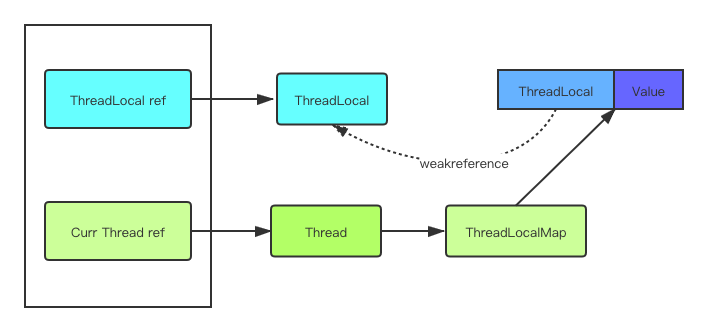

## Threadlocal使用

thread原理图

- 父子线程数据传递InheritableThreadLocal
InheritableThreadLocal只能通过父子线(1->1)程传递变量，线程池里面的线程有可能是多个父线程共享的(也就是1个父线程提交的任务有可能由线程池中的多个子线程执行)，因此有可能出现问题。阿里为了解决这个问题编写过一个框架-transmittable-thread-local，解决了父线程和线程池中线程的变量传递问题。

[alibaba父子线程ThreadLoad传递](https://github.com/alibaba/transmittable-thread-local)

参考

[ThreadLocal源码分析](https://juejin.im/post/5e4625df6fb9a07cbc268b84?utm_source=gold_browser_extension)