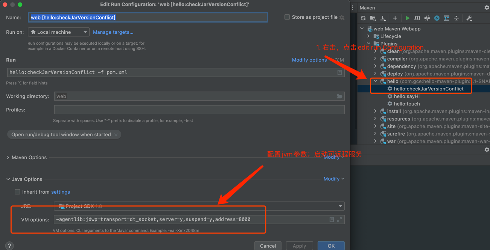
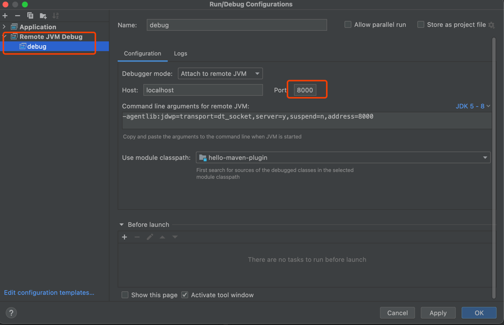
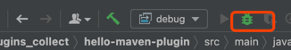

# MAVEN 插件开发调试

## 调试者

1. 配置如下

> 开启远程debug服务，jvm参数配置： `-agentlib:jdwp=transport=dt_socket,server=y,suspend=y,address=8000`

2. 点击run启动服务

## 调试插件

1. 配置如下  

>远程debug调试 jvm参数：`-agentlib:jdwp=transport=dt_socket,server=y,suspend=n,address=8000`

2. 开启debug

