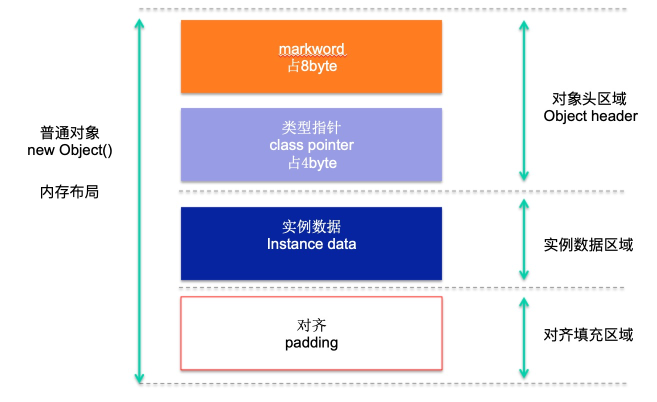

# 对象创建和内存分配
## Java对象结构
- java对象结构图如下



- 对象头区域此处存储的信息包括两部分：

    - 对象自身的运行时数据( MarkWord )  
    存储 hashCode、GC 分代年龄、锁类型标记、偏向锁线程 ID 、 CAS 锁指向线程 LockRecord 的指针等， synconized 锁的机制与这个部分( markwork )密切相关，用 markword 中最低的三位代表锁的状态，其中一位是偏向锁位，另外两位是普通锁位。
    - 对象类型指针( Class Pointer )  
对象指向它的类元数据的指针、 JVM 就是通过它来确定是哪个 Class 的实例。

- 实例数据区域 
    
    此处存储的是对象真正有效的信息，比如对象中所有字段的内容

- 对齐填充区域

    JVM 的实现 HostSpot 规定对象的起始地址必须是 8 字节的整数倍，换句话来说，现在 64 位的 OS 往外读取数据的时候一次性读取 64bit 整数倍的数据，也就是 8 个字节，所以 HotSpot 为了高效读取对象，就做了"对齐"，如果一个对象实际占的内存大小不是 8byte 的整数倍时，就"补位"到 8byte 的整数倍。所以对齐填充区域的大小不是固定的。    
 
 
- 如图所示对象头包含：markword(_mark)和class对象指针(_klass)
    - markword占用8个字节，用于存储对象自身的运行时数据，如哈希码（HashCode）、GC分代年龄、
        锁状态标志、线程持有的锁、偏向线程ID、偏向时间戳等
    - class对象指针：占用8个字节如果开启指针压缩的话则占用4个字节，即对象指定的是那个实例对象

> 所以一个对象如果未声明任何属性的话占用的内存为16字节或8字节(开启指针压缩)开启指针压缩方式`-XX:+UseCompressedOops`默认是开启的；
实际数据对象(`instance_data`)：占用的是对象指针大小`8个字节`开启指针压缩的话就占用`4个字节`;
补齐填充(padding):对齐`8个字节`，即对象头+对象实例数据的大小要是`8的倍数`；

如下代码
```java
public class A  {
    private Long i = 1L;
   private String s1;
    /* private String s2;
    private String s3;
    private String s4;*/

}
```
>此时占用的内存大小为:`12(markWord->8class对象指针->4) +4(对象地址)+4(对象地址)=24bytes`;仔细的你肯定发现这不是等于20嘛?
是的；因为有对齐补充即地址的总和是`8的倍数`；所以这里是24； **static属性是不占堆内存的**
若未开启对象指针压缩:16 + 8 + 8 = 32;

使用java小工具： jmap -histo ${pid} 可以查看对象的大小

Integer 和int 占用的内存分别是多少呢？
Integer:16个字节  ；int 占 4个字节；


