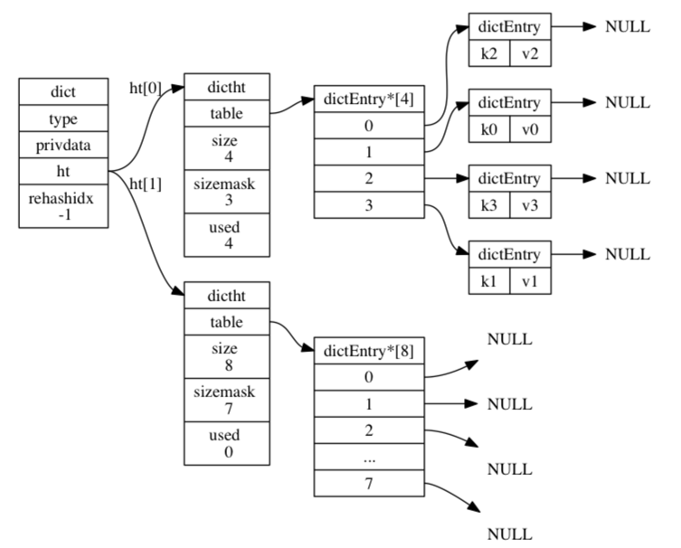

# redis数据结构

> redis五种数据结构：`String` `List`  `hash` `set` `sort set`  `bitmaps` `hyperloglogs` 

内部存储如图  

如图所示：
ht[0]作为DB在使用；  
ht[1]在做hash的是否用到；
## redis dict 

- 数据结构
```c

/* 哈希桶 */
typedef struct dictEntry { 
    void *key;     // 键定义
    // 值定义
    union { 
        void *val;    // 自定义类型
        uint64_t u64; // 无符号整形
        int64_t s64;  // 有符号整形
        double d;     // 浮点型
    } v;     
    struct dictEntry *next;  //指向下一个哈希表节点
} dictEntry;

/* hash表结构定义 */
typedef struct dictht { 
    dictEntry **table;   // 哈希表数组
    unsigned long size;  // 哈希表的大小
    unsigned long sizemask; // 哈希表大小掩码
    unsigned long used;  // 哈希表现有节点的数量
} dictht; 


/* 字典结构定义 */
typedef struct dict { 
    dictType *type;  // 字典类型
    void *privdata;  // 私有数据
    dictht ht[2];    // 哈希表[两个]
    long rehashidx;   // 记录rehash 进度的标志，值为-1表示rehash未进行
    int iterators;   //  当前正在迭代的迭代器数
} dict;
```      


## string 
  
  > 对应的底层数据结构为 SDS(Simple Dynamic String);
- 底层数据结构
```c
struct sdshdr {
    // 记录 buf 数组中已使用字节的数量
    // 等于 SDS 所保存字符串的长度
    int len;
    // 记录 buf 数组中未使用字节的数量
    int free;
    // 字节数组，用于保存字符串
    char buf[];
};
```

## list
> 列表

- 数据结构
```c

typedef struct listNode {
    // 前置节点
    struct listNode *prev;
    // 后置节点
    struct listNode *next;
    // 节点的值
    void *value;
} listNode;
```

## hash 
> hash数据结构

```c

/* hash表结构定义 */
typedef struct dictht { 
    dictEntry **table;   // 哈希表数组
    unsigned long size;  // 哈希表的大小
    unsigned long sizemask; // 哈希表大小掩码
    unsigned long used;  // 哈希表现有节点的数量
} dictht; 
```

## set

> set 有2个数据结构

- intset
    - 结合对象保存的所有元素都是整数值
    - 集合对象保存的元素数量不超过512个

```c

typedef struct intset {
    
    // 编码方式
    uint32_t encoding;

    // 集合包含的元素数量
    uint32_t length;

    // 保存元素的数组
    int8_t contents[];

} intset;
```

- hashtable
    - key 为hash的值，value为 null ；
```c

typedef struct dictht { 
    dictEntry **table;   // 哈希表数组
    unsigned long size;  // 哈希表的大小
    unsigned long sizemask; // 哈希表大小掩码
    unsigned long used;  // 哈希表现有节点的数量
} dictht; 
```

## zset

> zet  ziplist 
```c

/*
 * 有序集
 */
typedef struct zset {

    // 字典
    dict *dict;

    // 跳跃表
    zskiplist *zsl;

} zset;
```

使用ziplist 满足的条件：
  1. 元素个数< 128
  2. 每个元素的大小小于 64字节；
否则就使用skiplist

