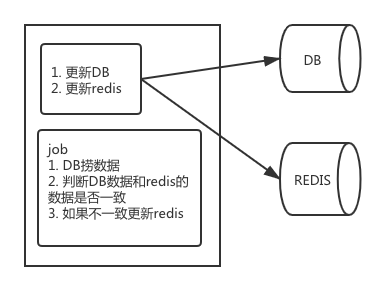
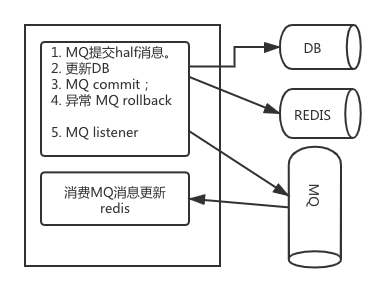

# 缓存一致性解决方案

在什么场景下需要引入缓存   
随着互联网的普及，用户量和访问量越来越大，我们的应用程序就需要支撑更大的并发量以及计算量；服务器资源是有限的，但是技术变革又是缓慢的，
同时数据库每秒能接受的请求量也是有限的；在有限的资源下，如何尽可能的提高并发量呢。在这个情况下劳动人民的智慧就发挥出来了，
将传统的系统流程中引入缓存，将计算出来的数据加入到缓存中；从而减少计算量，有效提高访问量；使得有效的资源能提供更大访问量；

然而引入缓存后会会出现另一个问题：缓存一致性问题；  
下面我们就讨论下缓存一致性的解决方案

## 缓存一致性解决方案

> 对于加入缓存我们一般会加入两级缓存 app local cache(应用本地缓存)作为一级缓存 redis作为二级缓存最后才访问DB

- 首先如何保证redis数据和DB数据一致性；
因为redis和DB不在一个事务里，所以不管是先更新DB或redis 最终都有可能导致数据不一致的情况出现（如果一件事情有可能发生，这件事一定会发生）；  

**解决方案**
1. 引入定时任务：  
更新DB和redis后，我们会有一个定时任务定时检测redis中的数据和DB的数据是否一致，对于我们会引入timestamp来保证数据的一致性；
如下图



缺点：  
    1. 需要引入定时任务，而且每次都要全量扫描表中那些数据被修改了，增加了很多的无效数据扫描；
    2. 同时其实大多数情况下定时任务都是没有更新数据的；
    3. DB和redis的不一致性时间可能比较长；取决于定时任务时间间隔和运行时间；


2. 引入RocketMQ：
利用RocketMQ的事务机制来保证DB和redis的数据一致性；
    1. 更新DB时 ，同时向MQ发送一条消息；(当然这条消息是事务消息)
    2. 应用本身消费这条MQ消息此时更新redis的值；保证redis的值和DB的值一致；
如下图：


    
缺点：  
    1. 需要额外引入MQ；
    2. 使得代码更复杂了；


- redis和应用本地缓存的一致性问题
应用本地缓存面临2个问题

1. 保证数据的一致性，包括各个进程缓存的数据要是一致的，进程缓存和 Redis 缓存要是一致的；
2. 尽可能减小网络压力；

如何解决上面的问题：

1. 使用定时刷本地缓存机制，通过定时任务判断本地缓存的数据和redis的是否一致；不一致更新数据；同样使用timestamp来判断；

2. 通过消息广播的形式，如果redis消息发生修改了，通过广播（redis或MQ)key 通知到各个应用进程更新本地缓存数据；

以上是目前主流的缓存一致性解决方案  缺点是：如果key值很大、导致需要的带宽就很大；同时对于同时对于没有对应key
的应用程序也会受到广播通知更新

下面介绍下redis 6.0 的一个新特性 redis client side cache (redis客户端缓存) 

redis client side cache 保证了redis client和redis server数据的一致性；

那么是如何保证的呢 ？
redis server linkedList 保存slots(槽点)对应链接的客户端；如下图
```text
slot1 -> client1 -> client2 -> client5
slot2 -> client2
slot3 -> null
slot4 -> client9 -> client1 -> client2
...
slot16777216 -> client23 -> client24
```
每一个 client 都有一个 unique ID，第四行就表示，client 9，1，2 读取了 slot4 中的数据。
client假设 slot4 中的 key 更新了，那么 Server 将会把 Slot 更新的信息发送给这三个客户端。


参考：

[redis-side-cache](https://redis.io/topics/client-side-caching)


