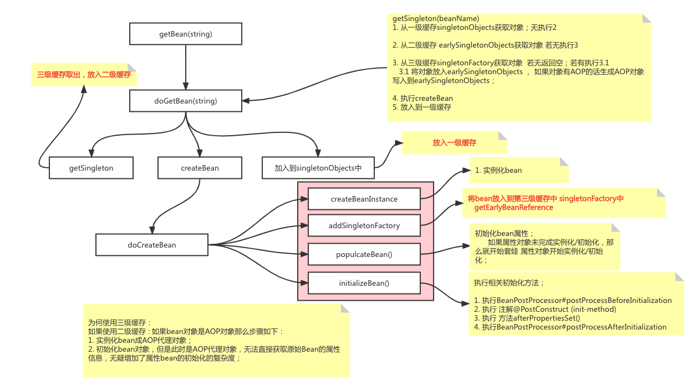

# spring初始化过程
## 如图

### spring解决循环依赖的核心机制是通过使用三级缓存：

- 一级缓存 (singletonObjects)：存储完全初始化好的Bean；
- 二级缓存(earlySingletonObjects)：存储`原始实例`，还未完全初始化完成的Bean；
- 三级缓存 (singletonFactories)：存储ObjectFactory，用于生成** Bean的代理对象或原始对象 **；

为何使用三级缓存：如果使用二级缓存 :如果bean对象是AOP对象那么步骤如下：  

1. 实例化bean成AOP代理对象；  
2. 初始化bean对象，但是此时是AOP代理对象，无法直接获取原始Bean的属性信息，无疑增加了属性bean的初始化的复杂度;