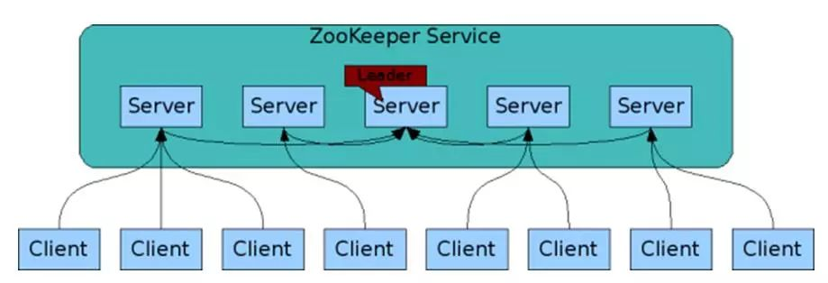

## 简介
> zookeeper是一个分布式服务框架，主要是解决分布式系统的协调和一致性问题，他能提供基于类似文件系统的目录树结构方式的数据存储，但是zookeeper并不是用来存储数据的，
他主要的作用是用来维护和监控存储的数据的状态的变化；比如：状态同步服务、集群管理、分布式应用的配置管理等；

## 架构和原理

zookeeper集群是由一组Server节点组成，这组Server中
有个节点的角色为Leader，其他节点的角色为Follower；客户端可以和集群中的任一Server节点建立连接，当读请求时，
所有Server节点都可以返回结果，当请求更新时，Follower节点会将请求转发给Leader节点，Leader节点接收到数据变更请求后，首先会将数据写入本地磁盘，以作恢复，当持久化
完后更新内存，并就变更后的结果同步到各个节点；

Zookeeper有以下角色

- ***Leader*** ：  负责投票的发起和决议，更新状态和数据
- ***Follower***：用于接受客户端的请求并向客户端返回结果，在选择Leader时会进行投票
- ***Observer***：一种与`Follower` 功能相同，但是不参与Leader选举时投票；他主要是为了扩展系统，提高读取速度；
- ***Client***：客户端用来发起请求，严格来说不属于zookeeper集群

## 工作机制
zookeeper的核心是Zab(zookeeper atomic Broadcast)协议，Zab协议有2种模式分别为：`恢复模式` 和 `广播模式`
### 恢复模式
当zookeeper启动或Leader崩溃时就会进入该模式，该模式需要选出新的Leader,选举算法基于paxos或fastpoxos

### 广播模式
Leader选举完毕后,Leader需要与Follower进行数据同步：
1. leader开始等待Server节点链接；
2. Follower链接leader ，将最大zxid 发送给leader；
3. Leader根据Follower确认同步点；
4. 完成同步后通知Follower已经成为update状态；
5. Follower接收到update消息后，就可以重新接受client的请求进行服务了；

### Watch监听机制

    客户端能在znodes上设置watch，监听znode的变化，包括增删改查，通过stat path ，ls2 path get path皆可查看
    触发watch事件的条件有4种，create，delete，change，child（子节点事件）

- watch的重要特性

    1.仅一次性：watch触发后会立即删除，要持续监听变化的话就要持续提供设置watch，这也是watch的注意事项
    
    2.有序性：客户端先得到watch通知才可查看变化结果
    
    
## 典型应用场景(CAP 实现了cp)
### 数据的发布/订阅

### 命名服务

### master选举

### 分布式锁