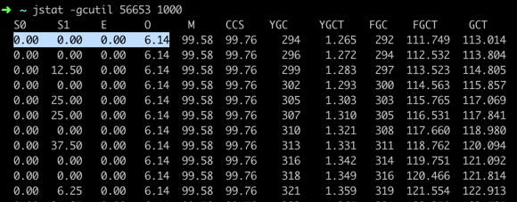
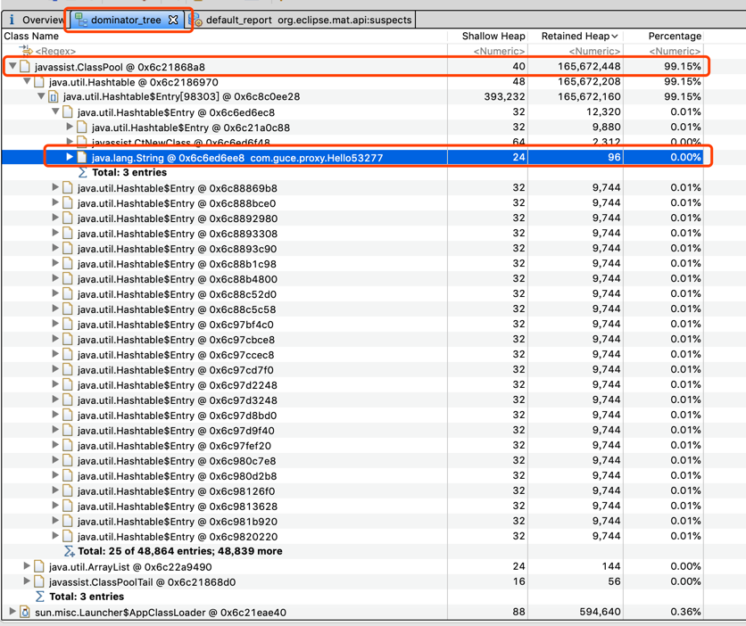

# 堆内存分析


## metaspace oom分析

### 现象
1. 日志一直抛`java.lang.ClassFormatError: Metaspace` 异常
1. 一直在进行FGC ，而且FGC的时长越来越长
2. 堆内存不一定用完了，同时堆内存一直不变了；
3. 出现CPU一直飚高

### 问题定位

1. 日志分析
```text
javassist.CannotCompileException: by java.lang.ClassFormatError: Metaspace
	at javassist.util.proxy.DefineClassHelper.toClass(DefineClassHelper.java:274)
	at javassist.ClassPool.toClass(ClassPool.java:1232)
	at javassist.ClassPool.toClass(ClassPool.java:1090)
	at javassist.ClassPool.toClass(ClassPool.java:1048)
	at javassist.CtClass.toClass(CtClass.java:1290)
	at com.guce.MetaSapce.main(MetaSapce.java:17)
Caused by: java.lang.ClassFormatError: Metaspace
	at javassist.util.proxy.DefineClassHelper$Java7.defineClass(DefineClassHelper.java:182)
	at javassist.util.proxy.DefineClassHelper.toClass(DefineClassHelper.java:263)
	... 5 more
```

2. 查看GC情况 ： `jstat -gcutil ${pid} 1000`  可以看到每一秒GC的情况 (如果有监控工具直接使用监控也可以看到)
   
如图看到

    1. 堆内存 S0 , S1 ,E , O 其实都还没用满
    2. M(metaspace) 已经使用率达到99.58% 了 ；CCS(Compressed class space) 已经使用了 99.76%;
    3. 频繁的进行FGC；
> JVM 参数 -XXmetaspaceSize=20m :设置metaspac每次扩容20M的进行一次FGC 
>         -XXmaxMetaspaceSize=25m6 ：设置最大Metaspace大小为256m；默认不设置 理论大小跟物理内存的一样大；

3. dump堆信息 对堆进行分析
 命令：`jmap -dump:live,format=b,file=metaspace.hprof 56653`  
    使用MAT (memory anaylizer tool)分析堆内存 ；当然也可以使用命令  jhat来分析；
 
   
 发现javassist 一直在创建com.guce.HelloXXX类；
 此时基本已经定位到问题；
 
    mat简单说明
    1. Dominator Tree：检查代码是否出现内存泄漏可以看这个tab ；提供对象之间的引用关系；
    2. Histogram ： 查看对象的数量
    
    
 
 测试代码
 ```java
import javassist.ClassPool;

/**
 * @Author chengen.gce
 * @DATE 2020/4/6 10:24 上午
 */
public class MetaSapce {

    private static javassist.ClassPool cp = ClassPool.getDefault();
    public static void main(String[] args){
        

        for ( int i = 0 ; ; i++){
            try {
                cp.makeClass("com.guce.proxy.Hello" + i).toClass();

            }catch (Exception e){
                e.printStackTrace();
            }

        }

    }
}
```