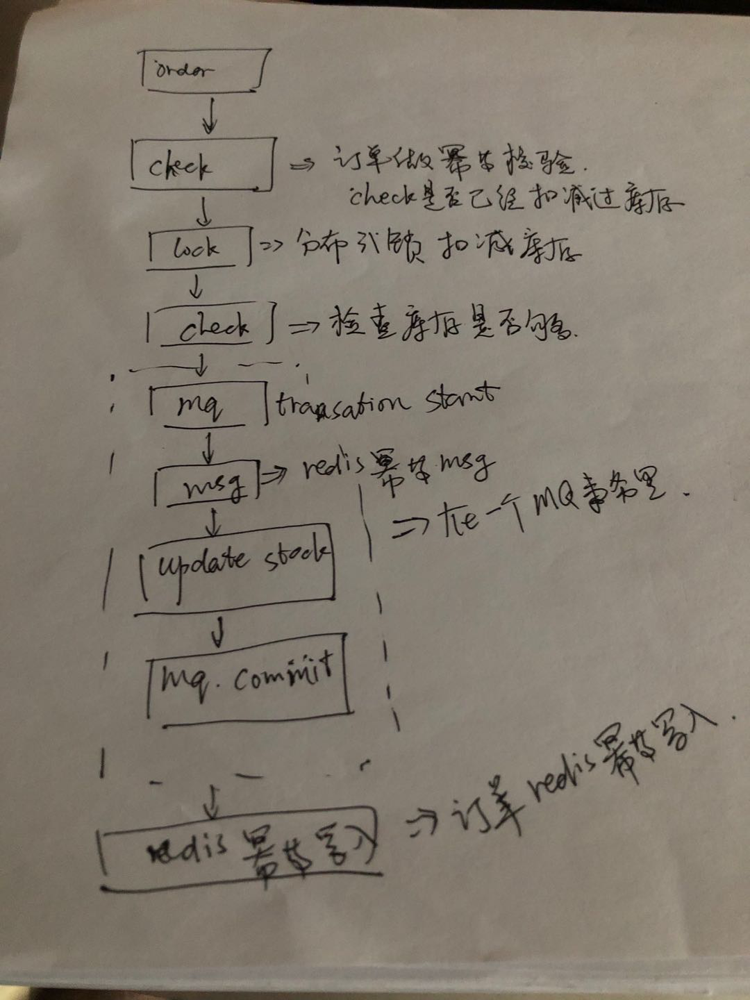

# 扣减库存如何实现幂等

## 实现方法

- 使用数据库来保证幂等
    - 首先有一张幂等表(order_id,user_id,product_id ...)
    - 在更新库存时将订单数据幂等数据同时写入幂等表中(insert update 在同一个事物里)
> 这样就能保证幂等实现；

- 使用MQ+redis+DB 实现扣减库存

使用MQ来做事务保证；redis做幂等保证；DB做库存扣减
MQ开启事务 将要写入到redis的数据 作为msg发送到MQ 同时扣减库存 ；成功则提交MQ ；失败回滚；
对于成功后 我们还能再次将redis幂等数据写入一次redis 作为double写入；保证同步；

