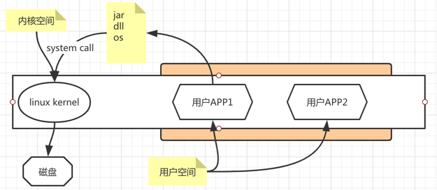
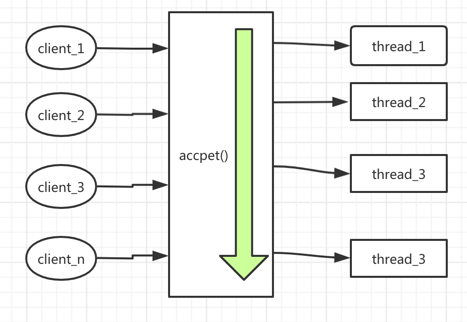
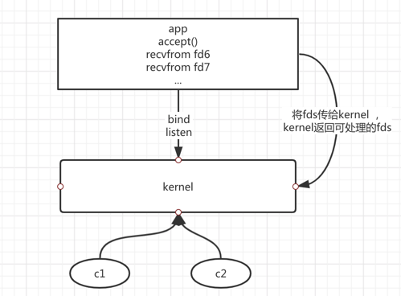
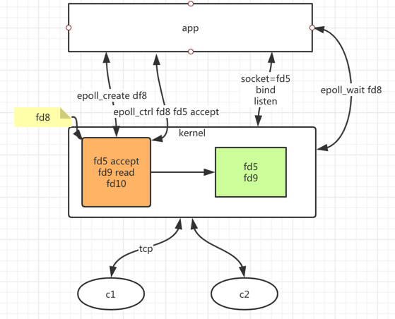

# 浅谈IO那点事-笔记

历史演进图

.png)


1. 概念说明 
    - 用户空间和内核空间 
    - 保护模式
    - 用户态和内核态
    - 切换
    
    
    
    如图
    用户app1/用户app2 为用户空间 ； linux kernel :为内核空间
    保护模式：用户空间不能直接访问内核空间
    比如：用户app需要读写文件，其实用户程序是不能直接操作文件，需要通过内核空间才能访问到文件，所以这里设计到一个用户态向内核态的切换；
2. IO发展历程 

    BIO：`阻塞IO`  NIO：`非阻塞IO`  AIO：`异步IO`

开始阶段IO为BIO 




如图在IO模式中  
    对于每个客户端调用应用程序时，都需要通过accept来接受读取客户端数据，此时是阻塞的直到读取完成；
```java
public static void main(String[] args) throws IOException {
        
        
        ServerSocket socketServer = new ServerSocket(8080);
        //阻塞等待客户端连接
        Socket socket = socketServer.accept();
        //等待读取数据
        InputStream in = socket.getInputStream();
        do something ...
        socket.getOutputStream().write(str.getBytes("UTF-8"));
    }
```
在这个情况下应用程序每次只能处理一个客户端请求，处理完结束后才能接受下一个客户端请求，继续处理；  
对于这个模式下处理太慢，每次只能处理一条数据，那么如何使用多线程处理，只要接受到一个客户端连接，处理数据时其他客户端也能建立连接并处理呢
如下：

```java
public static void main(String[] args) throws IOException {

        ServerSocket socketServer = new ServerSocket(8080);
        while(true){
            Socket socket = socketServer.accept();
            new Thread ( () -> {
                try {
                    InputStream in = socket.getInputStream();
                } catch (IOException e) {
                    e.printStackTrace();
                }
                ;
            }).start();
            
        }
       
    }
```
如上代码
当接收到每个客户端后都会开一个线程来处理客户端请求； 对此解决上面提到的问题；但是连带出现的另一个问题：有多少个客户端，服务端
就有多少个线程执行客户端数据随着线程数的增加服务端就会出现问题；服务端执行会越来越慢 同时可能导致堆栈溢出，或OOM；

对于这个问题，就有另一个解决办法：使用线程池指定同时处理客户端请求的数量；但是在接受客户端请求时还是阻塞的；随着技术发展出现NIO

### NIO
NIO有叫非阻塞IO也有叫newIO

NIO 非阻塞IO 多路复用 select  poll  epoll




非阻塞IO 服务端可以与多个客户端建立连接。每个IO连接对应一个fd(文件描述符)
select poll模式
1. 应用程序循环将需要处理的fds传输给kernel ; 
2. kernel 循环判断客户端请求数据是否已到达，将已到达的fds以事件的形式通知应用程序；
3. 应用程序处理对应的请求；比如服务端和客户端有1000 连接建立 ；但是请求到达的客户端有8个，此时服务端处理会处理这8个请求；
> select 与poll模式的区别：select 最大可以有1024 个fd连接数 ；poll对连接数没有限制，理论上取决于内存的大小

epoll模式




1. epoll_create  创建文件描述符(fd8)
2. epoll_ctl     fd8  fd5 accept : 程序accept时会创建fd5 同时他的时间accept接收连接
3. epoll_wait    epoll_wait f8  等待监听客户端连接

当有客户端和服务端要建立连接时
1. 客户端想要和服务端tcp建立3次握手建立连接，
2. kernel就会就知道你想要建立连接，此时内核会将fd5 传给另一个内核空间
3. epoll_wait 就会将fd5 返回给app  此时 app会创建另一个fd9 建立连接；同时会将fd9 通过调用epoll_ctl传给fd8
此时内核同时监听了fd9。
4. 如果此时fd9的请求到达，同时又有另一个客户端需要建立连接；此时epoll_wait会知道有2个文件描述符fd5 和fd9传给app
fd5处理建立连接创建fd10 通过epoll_ctl传给fd8 ，同时app会接受fd9的请求，处理客户端请求，处理完成将数据返回；

