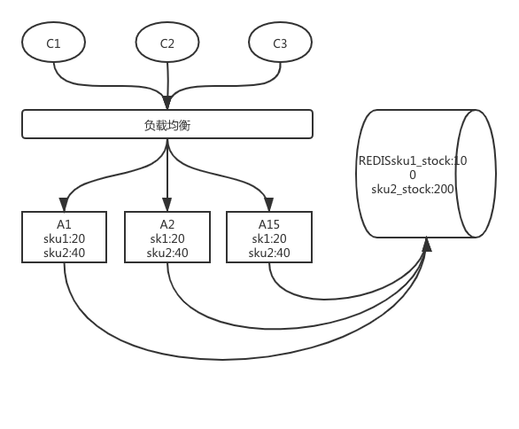
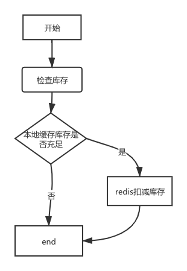

# 秒杀场景

考虑的问题

1. 瞬间流量
2. 库存问题
3. 防止超卖
4. 避免少卖

## 业务架构图



## 库存流程图



架构说明

对于每个商品在每个应用中都会放入 (1 + 0.2) * stock / n(应用数)  的库存数;
1. 首先会判断本地库存是否使用完，如果本地库存使用完了 ，直接返回无库存；
2. 通过redis扣减库存 ;

    2.1. redis判断商品是否存在；  
    
    2.2. 获取库存数； 
    
    2.3. 剩余库存数是否足够扣减；若足够扣减，直接扣减 ，再将订单购买的商品数放入redis做幂等 最后返回 1 ； 不够扣减直接返回 0；
    
    2.4. redis判断商品不足 返回0 ； 
    
    2.5. 商品不存在 返回 -1；  
```LUA
if (redis.call('exists',KEYS[1])){
    local stock = redis.call('get',KEYS[1]);
	if (stock >= ARGV[1]){
		redis.call('DECRBY',ARGV[1]);
		redis.call('set',KEYS[2],ARGV[1]);
		return 1;
	}
	return 0;
}
return -1;
```