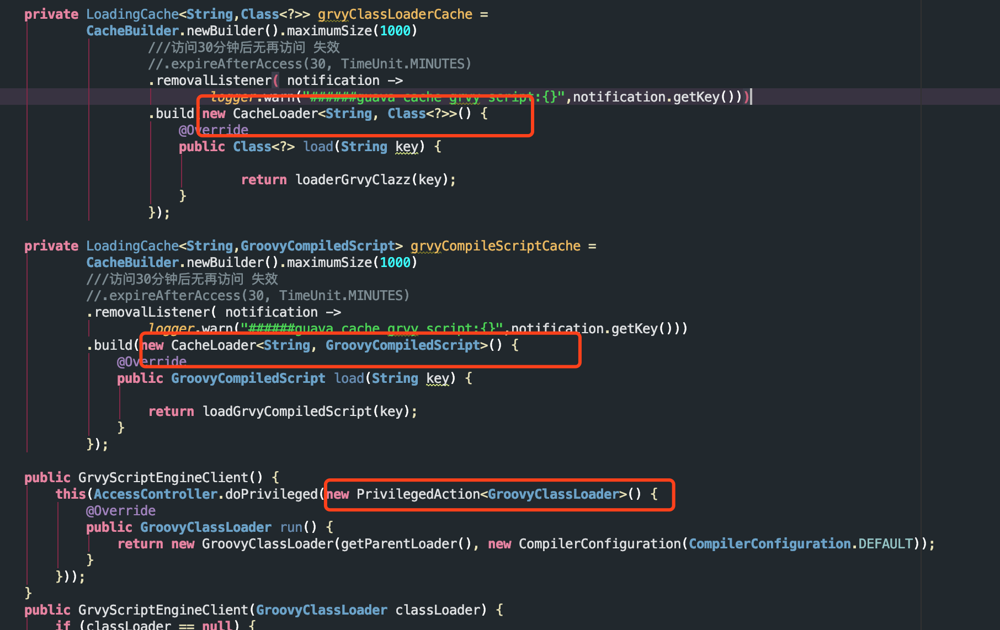

# java编译
在Java代码编译后，可能会出现 xxx$[1.2.3].class xxx$${InnerClass}.class

 xxx$[1.2.3].class  这个说明有在xxx.java中有匿名类
  xxx$${InnerClass}.class 说明在xxx.java中有内部类 类名为InnerClass
  
  比如com.grvyframework.grvy.engine.GrvyScriptEngineClient 中有3个匿名类
  
  