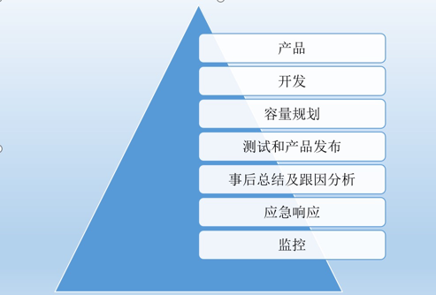
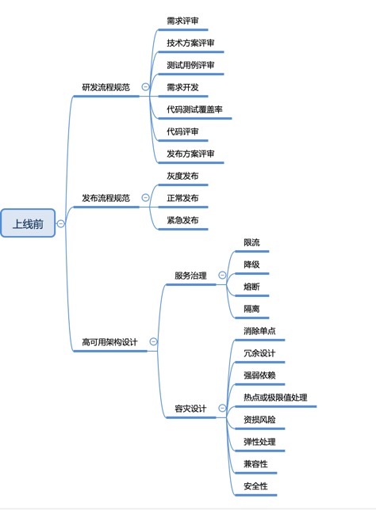
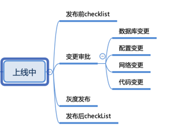
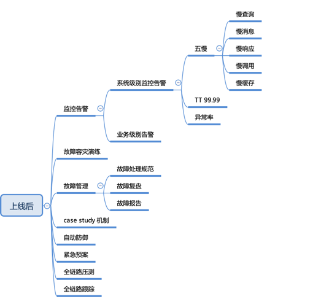

# 系统稳定性最佳实践

## 前言

系统的稳定性，主要决定于整体的系统架构设计，然而也不可忽略编程的细节，正所谓“千里之堤，溃于蚁穴”，一旦考虑不周，看似无关紧要的代码片段可能会带来整体软件系统的崩溃。

稳定性的工作，一般都是水下的工作。就像冰山，真正强大的系统下，要有更加强大的底层支撑，水面下的问题才是真正需要解决的问题。当然不一样的工作内容，水下的工作是不同的，对于盖楼来说，可能就是地基的深度。对于我们写业务逻辑来说，水下的工作就是CatchException的处理，异常情况的处理。对于系统来说，水下的工作可能是一些接口系统的稳定性。类似于金字塔结构，下层基础决定上层建筑。对于软件系统来说，稳定性至关重要。

在开始介绍服务稳定性之前，我们先聊一下SLA。SLA（service-level agreement，即服务级别协议）也称服务等级协议，经常被用来衡量服务稳定性指标。通常被称作“几个9”，9越多代表服务全年可用时间越长服务也就越可靠，即停机时间越短。通常作为服务提供商与受服务用户之间具体达成承诺的服务指标——质量、可用性，责任。

- 3个9，即99.9%，全年可停服务时间：365 * 24 * 60 *（1-99.9%）= 525.6min
- 4个9，即99.99%，全年可停服务时间：365 * 24 * 60 *（1-99.99%）= 52.56min
- 5个9，即99.999%，全年可停服务时间：365 * 24 * 60 *（1-99.999%）= 5.256min

在严苛的服务级别协议背后，其实是一些列规范要求来进行保障。

2021 年全球重大的系统事故，其中不乏亚马逊、特斯拉、Facebook 等行业巨头。

| 机构名称 | 发生时间    | 持续时长 | 影响范围                                               | 原因                       |
| -------- | ----------- | -------- | :----------------------------------------------------- | -------------------------- |
| 亚马逊   | 2021年12月  | 约3小时  | 全球亚马逊云计算服务                                   | 数据中心及网络连接问题     |
| 特斯拉   | 2021年11月  | 约5小时  | 特斯拉App全球范围服务中断                              | 配置错误导致网络流量过载   |
| Facebook | 2021年10月  | 约7小时  | Facebook及旗下Messenger、Instagram、WhatsApp等多个服务 | 运维操作失误               |
| 哔哩哔哩 | 2021 年7 月 | 约1小时  | 哔哩哔哩视频播放、直播等多项服务                       | 机房故障，灾备系统失效     |
| Fastly   | 2021 年6 月 | 约1小时  | 包括亚马逊、纽约时报、CNN 在内的登录网页               | 系统漏洞被配置更改操作触发 |
| 推特     | 2021 年3 月 | 约2小时  | 登录失败                                               | 系统内部错误               |
| 滴滴打车 | 2021 年2 月 | 约1小时  | 滴滴打车APP                                            | 系统内部错误               |
| 美联储   | 2021 年2 月 | 约4小时  | 美联储大部分业务                                       | 操作失误                   |

## 什么是系统稳定性

我们先看下百度百科对稳定性定义：

> 系统稳定性是指系统要素在外界影响下表现出的某种稳定状态。

其次维基百科对稳定性定义：

> 稳定性是数学或工程上的用语，判别一个系统在有界的输入是否也产生有界的输出。

若是，称系统为稳定；若否，则称系统为不稳定。

简单理解，系统稳定性本质上是系统的`确定性应答`。

从另一个角度解释，服务稳定性建设就是如何保障系统能够满足SLA所要求的服务等级协议。

Google SRE中（SRE三部曲）有一个层级模型来描述系统可靠性基础和高层次需求（Dickerson’s Hierarchy of Service Reliability），如下图：

 

该模型由Google SRE工程师Mikey Dickerson在2013年提出，将系统稳定性需求按照基础程度进行了不同层次的体系化区分，形成稳定性标准金字塔模型。

**监控（Monitoring）:** 是金字塔的底座，这是一个系统对于稳定性最基础的要求，缺少监控的系统，如同蒙上眼睛狂奔的野马，无从谈及可控性，更遑论稳定性。

**应急响应（Incident Response）：**从一个问题被监控发现到最终解决，这期间的耗时直接取决于应急响应机制的成熟度。合理的应急策略能保证当故障发生时，所有问题能得到有序且妥善的处理，而不是慌乱成一锅粥。

**事后总结以及根因分析（Postmortem&Root Caue Analysis）：**即我们平时谈到的“复盘”，虽然很多人都不太喜欢这项活动，但是不得不承认这是避免我们下次犯同样错误的最有效手段。只有当摸清故障的根因以及对应的缺陷，我们才能对症下药，合理进行规避。

**测试和发布管控（Testing&Release procedures）：**假设一个系统从初次发布后就不再进行更新迭代，做好上述三个方面的工作就能基本满足系统对于稳定性的全部需求。可惜目前基本不会存在这样的系统，大大小小的应用都离不开不断的变更与发布，因此要保证系统在这些迭代中持续稳定，测试和发布管理是必不可少的。有效的测试与发布策略能保障系统所有新增变量都处于可控稳定区间内，从而达到整体服务终态稳定。

**容量规划（Capacity Planning）：**除了代码逻辑更新，迭代同样可能带来业务规模及流量的变化，则是针对于这方面变化进行的保障策略。现有系统体量是否足够支撑新的流量需求，整体链路上是否存在不对等的薄弱节点，都是容量规划需要考虑的问题。

位于金字塔模型最顶端的是产品设计（Product）与软件研发（Development），即通过优秀的产品设计与软件设计使系统具备更高的可靠性，构建高可用产品架构体系，从而提升用户体验。

为了方便，本文阐述的系统主要指软件系统。那么如何衡量系统稳定性的高与低呢？一个常用的指标就是服务可用时长占比，占比越高说明系统稳定性也越高。如果我们拿一整年的数据来看，常见的 4 个 9（99.99%）意味着我们系统提供的服务全年的不可用时长只有 52 分钟！

它其实是一个综合指标，为什么这么说？因为我们在服务可用的定义上会有一些差别，常见的服务可用包括：服务无异常、服务响应时间低、服务有效（逻辑正确）、服务能正常触发等。

## 稳定性建设目标

架构设计源于生活，稳定性建设也肯定是源于生活，一般会把稳定性和消防放在一起进行比喻方便大家的理解，处理火灾主要是阶段：在火灾前预防火灾，在第一时间知道发生火灾了，在发生火情的时候如何快速救火。通过火灾处理对比软件系统的稳定性，也就是预防（事前）、发现和处理（事中）了，最后（事后）我们加入了复盘。发生问题不可怕，可怕的是已发生的问题重复发生。一定要杜绝有问题的事情第二次发生。

防火的最高境界是，防患于未然。这也就催生了，现代软件系统里面，大家把更多的精力放在事前（全链路压测和故障演练方面）。

## 稳定性治理

影响稳定性的主要在两个阶段，一个阶段是非运行期，一个阶段是运行期。非运行期主要就是我们日常进行开发的时候，技术方案设计，代码书写，线上操作配置等引发的稳定性问题。运行期主要是因服务自身问题、外部调用问题，外部依赖问题引发的稳定性，所以治理也主要从这两个方面出发。

接下来会以上线前、上线中、上线后三个阶段进行总结稳定性治理。

### 上线前

很多时候我们都以为系统稳定只是线上运行稳定就好了，但事实上需求研发流程是否规范，也会极大地影响到系统的稳定性。试想一下，如果谁都可以随便提需求、做的功能没有做方案设计、谁都可以直接操作线上服务器，那么这样的系统服务能够稳定得了吗？所以说，需求上线前的过程也是影响系统稳定性的重大因素。

在我看来，在上线前这个阶段，主要有三大块非常重要的稳定性建设内容，分别是：

1. 研发流程规范
2. 发布流程规范
3. 高可用架构设计

1、研发流程规范

研发流程规范，指的是一个需求从提出到完成的整个过程应该是怎样流转的。一般的需求研发流程包括：产品提出需求、技术预研、需求评审、技术方案设计、测试用例评审、技术方案评审、测试用例评审、需求开发、代码评审、需求测试。不同公司根据情况会有所调整，但大差不差。

在这个流程中，与研发相关的几个比较重要的节点是：技术方案设计及评审、测试用例评审及评审、需求开发、代码测试覆盖率、代码评审。我们上面提到的几个影响稳定性的因素，就是因为没有做好这几个节点的工作导致的，包括：

- 未测试需求直接上线
- 上线的需求产品不知道
- 上线的新需求有bug
- 上线后没有线上验证
- 系统设计方案存在缺陷
- 系统代码实现存在缺陷

如果能够处理好上述几个节点，那么就能够极大地降低研发流程导致的问题。这里每个节点都有很深的学问，这里就不展开讲了，我们主要说个思路。

研发团队最希望拿到的需求是真正有业务价值的需求，而不是一个短期或临时的需求。因为如果是一个临时需求的话，往往对应的解决方案也是临时的，如果太多临时的解决方案遗留在系统中，久而久之将会变成巨大的“技术债”，总有一天会爆发，对系统稳定性及业务迭代速度造成巨大影响。

另外有一点比较重要的是，通过需求评审，不仅仅是评审产品业务需求，更重要的是需要研发挖掘出一些非功能需求，包括性能指标要求、依赖三方接口QPS、安全等要求。

对于编码规范、技术方案评审、代码评审、发布计划评审，这里重点讲一下这四点。

1）编码规范

对外接口命名方式、统一异常父类、业务异常码规范、对外提供服务不可用是抛异常还是返回错误码、统一第三方库的版本、哪些场景必须使用内部公共库、埋点日志怎么打、提供统一的日志、监控切面实现等，编码规范除了能规范开发的编码行为、避免犯一些低级错误和踩一些重复的坑外，另一个好处是让新入职的同学能快速了解公司的编码原则，这点对编码快速上手很重要，更多可以参考阿里巴巴的Java开发规范。

2）技术方案评审

再也没有比糟糕的设计更有破坏力的东西了，技术方案设计评审和CR可以放在一起做，先评审设计再进行CR，有人就会说，都编码完了才进行设计评审是不是晚了？其实这要看情况而定，如果团队内部经常产出“糟糕设计”，那么我觉得设计评审就应该编码之前来做，但如果团队成员专业能力和经验都还不错，那么我们允许你再编码之后再做设计评审，而且编码的过程其实也是设计的过程，可以规避提前设计而导致后续编码和设计不一致的问题。设计评审的原则是，既要讲最终的设计方案，也要讲你淘汰的设计方案！

关于如何写技术方案以及评审更多细节，可以参考我之前公众号写的文章：《[如何写好&评审一份技术方案](https://mp.weixin.qq.com/s?__biz=MzA5MDYwNzM4Nw==&mid=2650754733&idx=1&sn=0ee9dabe9b0e09f71ea3d01a08048b92&scene=21#wechat_redirect)》

3）代码评审

代码质量包括功能性代码质量和非功能性代码质量，功能质量大多通过测试能够去发现问题，非功能性代码质量用户不能直接体验到这种质量的好坏，代码质量不好，最直接的“受害者”是开发者或组织自身，因为代码质量好坏直接决定了软件的可维护性成本的高低。

代码质量应该更多的应该从可测性，可读性，可理解性，容变性等代码可维护性维度去衡量，其中CodeReview是保证代码质量非常重要的一个环节，建立良好的CodeReview规范与习惯，对于一个技术团队是一件非常重要核心的事情，没有CodeReview的团队没有未来。

每次项目开发自测完成后，通常会组织该小组开发人员集体进行代码review，代码review一般review代码质量以及规范方面的问题，另外需要关注的是每一行代码变更是否与本次需求相关，如果存在搭车发布或者代码重构优化，需要自行保证测试通过，否则不予发布。

关于如何做好代码评审细节，更多可以参考我之前写的公众号文章《[如何做好CodeReview](https://mp.weixin.qq.com/s?__biz=MzA5MDYwNzM4Nw==&mid=2650754666&idx=1&sn=e518d9785ce8858601c73eaf34ed62ae&chksm=8802f41ebf757d083cfebeeb8528ae2198851aba83134ac9d010f2d69246baf021dc13205443&token=1548044970&lang=zh_CN&scene=21#wechat_redirect)》。

4）发布计划评审

涉及到10人日以上的项目，必须有明确的发布计划，并组织项目成员统一参加项目发布计划review。发布计划主要包含如下几点：

1. 明确是否有外部依赖接口，如有请同步协调好业务方；
2. 发布前配置确认包括配置文件、数据库配置、中间件配置等各种配置，尤其各种环境下的差异化配置项；
3. 二方库发布顺序，是否有依赖；
4. 应用发布顺序；
5. 数据库是否有数据变更和订正，以及表结构调整；
6. 回滚计划，必须要有回滚计划，发布出现问题要有紧急回滚策略；
7. 生产环境回归测试重点 Case。

2、发布流程规范

发布流程规范主要是为了控制发布权限以及发布频率的问题。

在项目初始，为了快速响应业务，一般权限控制都很松，很多人都可以进行线上服务的发布。但随着业务越来越多、流量越来越大，相对应的故障也越来越多，到了某个时候就需要对权限做管控，并且需要对需求的发布频率做控制。

对于需求发布流程来说，一般有几种发布方式，分别是：Release Train方式、零散发布方式。Release Train意思是固定时间窗口发布，例如每周四发布一次。如果无法赶上这次发布时间，那么就需要等到下次发布窗口。零散发布方式，指的是有需要就发布，不做发布时间控制。但这种方式一般只在项目初期发挥作用，后期一般都会收紧。

除此之外，发布流程中都会设有紧急发布流程，即如果某个需求特别重要，或者有紧急漏洞需要修复，那么可以通过该流程来紧急修复，从而避免因未到时间窗口而对业务产生影响。但一般来说，紧急发布流程都比较麻烦，除非迫不得已不然不要审批通过，不然Release Train方式可能会退化成零散发布方式。

3、高可用架构设计

高可用架构设计指的是为了让系统在各种异常情况下都能正常工作，从而使得系统更加稳定。其实这块应该是属于研发流程规范中的技术方案设计的，但研发流程规范更加注重于规范，高可用设计更加注重高可用。另外，也由于高可用设计是非常重要，因此独立拿出来作为一块来说说。

对于高可用设计来说，一般可分为两大块，分别是：服务治理和容灾设计。

服务治理就包括了限流、降级、熔断、隔离等，这一些考虑点都是为了让系统在某些特殊情况下，都能稳定工作。例如限流是为了在上游请求量太大的时候，系统不至于被巨大的流量击垮，还可以正常提供服务。服务治理这块像SpringCloud Alibaba都有标准的成熟解决方案，比如可以基于sentinel实现限流、降级、熔断、隔离，隔离可以实现线程池隔离和信号量隔离，这里不再做详细介绍。

容灾设计应该说是更加高端点的设计了，指的是当下游系、第三方、中间件挂了，如何保证系统还能正常运行。可以说容灾设计比起服务治理，其面临的情况更加糟糕。例如支付系统最终是通过A服务商进行支付的，如果A服务商突然挂了，那我们的支付系统是不是就挂了？那有什么办法可以在这种情况（灾难）发生的时候，让我们的系统还能够正常提供服务呢？这就是容灾设计需要做的事情了，接下来将重点介绍一些容灾设计方案。

1）消除单点

从请求发起侧到服务处理返回的调用全链路的各个环节上避免存在单点（某个环节只由单个服务器完成功能），做到每个环节使用相互独立的多台服务器进行分布式处理，要针对不同稳定性要求级别和成本能力做到不同服务器规模分布式，这样就避免单个服务器挂掉引发单点故障后进而导致服务整体挂掉的风险。

可能涉及的环节有端动态获取资源服务（HTML&JS&小程序包等）、域名解析、多服务商多区域多机房IP入口、静态资源服务、接入路由层、服务逻辑层、任务调度执行层、依赖的微服务、数据库及消息中间件。

冗余依赖，消除单点的策略：

- 在服务逻辑层采用多运营商多IP入口、跨地&同地多机房部署、同机房多机器部署、分布式任务调度等策略。
- 在数据存储层采用数据库分库分表、数据库主从备集群、KV存储&消息等分布式系统集群多副本等策略。
- 有分布式处理能力后，需要考虑单个服务器故障后自动探活摘除、服务器增删能不停服自动同步给依赖方等问题，这里就需引入一些分布式中枢控制系统，如服务注册发现系统、配置变更系统等，例如zookeeper是一个经典应用于该场景的一个分布式组件。

2）冗余设计

冗余设计，对于飞机而言，体现在机组包括机长副机长，引擎至少双发，操作系统至少两套等等，于我们的系统而言，则通常体现在:

- 数据冗余，数据多份副本，DB 一主多备，出现问题时可以快速切换。
- 计算能力冗余，服务器的计算能力始终保持一定冗余，在一组服务器出现问题时其他服务器可以接替提供服务,亦或在业务量波动时可以承受冲击。
- 网络，存储或其他基础设施冗余，出现意外时，比如断电，光纤断裂时均有备用可以实现切换，快速恢复。

冗余设计这块直接延伸出来的异地多活方案，更多详细的设计可以参考我之前写的公众号文章：《[高可用容灾架构演进之路](https://mp.weixin.qq.com/s?__biz=MzA5MDYwNzM4Nw==&mid=2650754966&idx=1&sn=9babef2fc85b31dc219a1c1f6591d597&chksm=8802f5e2bf757cf4b7787c509999b4d0165be8584039fe3844d8243f1da2f9494aae9d33c410&token=1548044970&lang=zh_CN&scene=21#wechat_redirect)》

3）强弱依赖

当服务依赖各类微服务时，避免强依赖（依赖服务挂掉会到自己服务挂掉），尽可能在对应服务出现问题时做到自动降级处理（弱依赖）或者手工降级，降级后依赖服务功能局部去掉或做合适局部提示，局部体验上有部分降级，但不会让主链路和整体功能挂掉。

对于稳定性要求很好的关键系统，在成本可接受的情况下，同时维护一套保障主链路可用的备用系统和架构，在核心依赖服务出现问题能做一定时间周期的切换过渡（例如MySQL故障，阶段性使用KV数据库等）。

强依赖的服务越少，系统整体基础稳定性就越高。部分特殊数据依赖多于逻辑依赖的系统，做去依赖架构设计也是一个思路，将依赖服务数据统一整合到自有服务的数据存储中，通过消息 或定时更新的方式更新，做到不依赖 或少依赖其他系统，进而提高稳定性，但这样做也会有副作用：数据冗余可能会引发不同程度一定时间窗口数据不一致性。

4）热点极限值处理

业务规模以及数据规模大的部分系统，在系统中会出现数据热点、数据极度倾斜、少量大客户超过极限阈值使用等极限场景，例如超级大客户广告投放物料、广告点击展示数据、API调用频次都是比普通客户大很多，如果按照客户维度分库分表，基本在物料更新、查询、报表查看等一系列的场景都可能导致单库抖动，这除了影响大客户自己外也会影响分布在该分库分表上所有普通客户。

电商中极度畅销商品以及秒杀、微博等订阅类明星大V的信息发布等都是少量极限场景可能会引发整体系统稳定性问题。因此，架构设计时，要分析自己系统中是否存在极限场景并设计对应方案做好应对。

极限场景中不同类型场景处理架构方案也不一样，可能的方式：

- 大客户从普通客户分库分表中拆出来隔离建库表，隔离享用专有资源以及独立库表拆分路由逻辑以及隔离服务逻辑计算资源；
- 大客户特定极限数据计算做预约计算以及预加载，在低峰期预约或提前优化完成；
- 秒杀系统极限值可以考虑核心逻辑简化+消息解耦、同商品库存拆分独立交易、部分查询或处理KV存储替代关系型存储、数据提前预热加载、排队、限流策略等策略；
- 在特定极限值系统架构以及资源无法满足的情况，产品侧以及技术侧要明确采用最高阈值调用限制。

5）资损风险

交易系统对于数据准确性、一致性、资金损失等都是很敏感的，这一块在是否使用缓存、事务一致性考量、数据时延、数据不丢不重、数据精准核对和恢复等需要额外架构设计考量。

仔细评估交易以及营销的全链路各个环节，评估其中出现资损的可能性以及做好应对设计，例如增加多层级对账、券总额度控制、异常金额限制和报警等资损防控的考量等。

不同层次不同维度不同时间延迟的对账以及预案是一个重要及时感知资损和止血的有效方式。全链路的过程数据要做好尽可能持久化和冗余备份，方便后续核对以及基于过程数据进行数据修复，同时尽量针对特殊数据丢失场景提供快速自动化修复处理预案（如交易消息可选择性回放和基于幂等原则的重新消费）。

6）弹性处理

消息重复消费、接口重复调用对应的服务是否保证幂等？是否考虑了服务降级？哪些业务支持降级？支持自动降级还是手工降级？是否考虑了服务的超时熔断、异常熔断、限流熔断？触发熔断后对客户的影响？服务是否做了隔离，单一服务故障是否影响全局？这些问题统统需要我们想清楚对应的解决方案，才会进一步保证架构设计的合理性。

7）兼容性

上下游依赖是否梳理过，影响范围多大？怎么进行新老系统替换？新老系统能否来回切换？数据存储是否兼容老的数据处理？如果对你的上下游系统有影响，是否通知到上下游业务方？上下游依赖方进行升级的方案成本如何最小化？这些问题需要有完美的解决方案，稍有不慎会导致故障。

8）安全性

是否彻底避免 SQL 注入和 XSS？是否有数据泄露的可能性？是否做了风控策略？接口服务是否有防刷保护机制？数据、功能权限是否做了控制？小二后台系统是否做了日志审计？数据传输是否加密验签？应用代码中是否有明文的 AK/SK、密码？这些安全细节问题需要我们统统考虑清楚，安全问题任何时候都不能轻视。

9）其他异常情况

整体系统架构高可用还需要考虑可测性、可运维性，除了正向逻辑、性能、扩展性设计等外，要增加一个异常设计视角，穷尽思考各类异常情况以及设计应对策略。

4、容量评估

系统设计整体至少考虑应对5到10倍或近1到3年系统规模增长，要保障后续通过增加机器资源等快速方式能实现系统水平扩容。例如分库分表的规模提前设计好提前量，避免临时数据库能力不足导致需要临时重构扩容（增加分库分表以及修改路由以及迁移数据）；服务逻辑层设计持有数据状态导致无法加机器做服务层扩容。

互联网产品发展变化较快，不一定会如期爆发，容量架构设计上也要注意不要过度提前设计，避免提前复杂化引发研发效率以及机器成本问题。

针对线上流量峰值，建议系统常态保持近期峰值3倍左右容量余量，上线前和上线后要定期做压测摸高，写流量可用影子表等方式做压测，压测可单接口以及模拟线上流量分布压测结合，根据压测结果优化架构或扩容，持续保持容量富余。

对于可能超过系统现有容量的突发峰值，限流策略是线上要配置的策略。入口侧入口流量调用 、不同渠道服务依赖调用、对依赖服务的调用都要评估可极限调研的上限值，通过中间件等合适方式限制超过阈值调用，避免引发雪崩效应。特定业务系统，对于超过峰值流量，可以通过消息架构以及合适体验设计做削峰填谷。针对恶意攻击流量也要考虑在入口层部署防DDOS攻击的流量清洗层。

部分系统峰值变化较大且需要持续尽可能承载保障，可考虑引入弹性伸缩策略，预约或根据流量变化触发系统自动扩缩容，以确保以尽量小成本来自动化满足变化峰值。

### 上线中

上线时这个阶段，主要是确保功能按照原先设计的方案进行部署，这个阶段主要是确保规范操作，避免失误，因此可以制定相关的CheckList以及变更审批。其次，为了避免还可能存在未发现的功能缺陷，有时候还可以使用灰度发布降低风险。在这个阶段能做的一些稳定性建设如下图所示。

对于发布前的checklist更多可以参考前面所讲的发布计划，发布后的checklist更多的需要根据测试提供的测试用例进行生产环境回归测试验证。

这里涉及到的变更审批非常关键，根据实际情况，有些审批可以提前提交申请。

灰度保障及时在小流量情况，发现问题，避免引发大范围故障。因此在做系统任何变更时，要考虑灰度方案，特别是大用户流量系统。灰度方式可能有白名单用户、按用户Id固定划分后不同流量比例、机器分批发布、业务概念相关分组分比例（例如某个行业、某个商品、某类商品）等，灰度周期要和结合系统风险和流量做合适设计，重要系统灰度周期可能持续超过一周或更多。

关于灰度发布更多细节，可以参考我之前公众号写的文章《[灰度发布架构设计终极篇](https://mp.weixin.qq.com/s?__biz=MzA5MDYwNzM4Nw==&mid=2650754937&idx=1&sn=af88a4e9c3ab7f6d9c6932674a9e6503&scene=21#wechat_redirect)》。

### 上线后

当系统成功上线后，很多小伙伴以为工作就结束了，但实际上我们还有不少工作可以做。根据我的经验，在上线后我们能做的稳定性建设包括：

1. 监控报警
2. 故障管理
3. 紧急预案
4. 故障容灾演练
5. 案例学习
6. 全链路压测
7. 全链路跟踪

1、监控告警

监控报警，指的是我们需要对应用做好运行数据的收集，监控好系统的运行状态。当系统状态异常时，我们需要及时地发现并报警，从而让研发人员快速地解决问题。一般来说，监控报警分为系统级别的监控报警和业务级别的监控报警。系统级别的监控报警包括 CPU、内存、磁盘等服务器资源的监控，而业务级别的报警则需要根据业务情况自行定义。

2、故障容灾演练

故障容灾演练需要从已知、半已知和未知三个维度去做。

- 已知：已知故障类型，按照应急预案SOP，一步一步去做，从生疏到熟练，从20分钟到5分钟，从有限的人能做变成所有人能做。
- 半已知：在已知故障类型的演练中，发现了未知因素，如：当缓存集群故障的时候，切换到备用缓存集群，但发现备用缓存集群里面的缓存数据有问题，需要重新清空及重新进行缓存预热。
- 未知：未知故障类型，临时决策安排人员有序散开排查，临时根据现象定位问题，采用回滚版本或者重启等方式尝试性解决问题，或定位到问题后，采用有损的方式试图临时解决问题等。

故障容灾演练是提升系统稳定性的一把利器，很多时候即使我们设计得很完美，但实际上却没发挥作用，究其根本就是没有实践过。是驴是马，得拉出来溜溜才知道。

3、故障管理

故障管理，就是当发生故障时，我们需要遵循的整套处理规范。团队小的时候可能无所谓，但是当团队大了的时候，我们就需要统一大家的故障处理流程，从而可以更快速地解决故障。此外，在故障解决完成之后还需要进行复盘，产出对应的故障报告。

4、Case Study

Case Study机制指的是定期学习其他团队的高可用或者线上故障进行学习，从而提高团队的系统设计能力，避免踩坑。

5、紧急预案

紧急处理预案，简单就是要想到各种可能发现的情况，然后做好预案。之后结合容灾演练不断进行优化，从而形成一套很好的处理预案。这样当线上发生类似故障时，就可以轻松应对了。

在发生故障的时候，大多数人的脑子都是一片空白，很难迅速做出最合理的反应。衡量一个应急预案的好坏，关键是看它是否足够“无脑化”。

举个例子：如果发现了故障A，那么我们需要排查B和C两个方面来精准定位问题，定位后，我们再通过D—>E—>F三个操作来解决问题。

即：整个过程中，只需要照做，不需要思考，因为思考就会产生选择，而选择取舍是最耗费时间的事情，如果做不到这点，那么证明应急预案还有优化的空间。

另外，预案也不是一蹴而就的事情，需要跟随架构和业务的演进，不断进行更新迭代，同时，也需要不断做减法，该摒弃的摒弃，该合并的合并，如果只增不减，那么一年以后，预案就会变成一本书。

紧急预案一般要包含如下内容：

- 故障发生时应该通知哪些人或团队。
- 如何选出协调者，什么情况下该选出协调者。
- 协调者的职责有哪些。
- 需要操作开关时，谁有权利决策。
- 常见故障以及对应的止损方式。
- 止损的原则是什么，什么是最重要的。善后方案谁来拍板。

预案很重要，完备的预案能降低故障定位和止损的时间，提升协作效率。

6、自动防御

这是件很能体现出工程师能力和素养的事情，需要工程师在coding过程中，在任何关键环节都具备安全意识。如：

- 当下游依赖的存储集群，由于不可用而触发代码中的失败次数或失败时间阈值时，自动切换到备用的存储集群。
- 当下游依赖的核心服务，由于不可用而触发代码中的失败次数或失败时间阈值时，自动降级到备用方案，如：将请求切换到存储非实时数据的ES中，接受有损。
- 当系统由于响应时间激增而导致服务不可用时，自动对下游依赖的非核心服务进行降级熔断，减少服务接口的整体响应时间，保证可用。

7、全链路压测

全链路压测，指的是对整个链路进行压测。不同公司可能会采用不同的方案，有些会直接在线上进行压测，然后用流量标记的方式识别测试流量。有些则是进行流量录制，之后重新搭建一套与线上非常类似的系统进行压测。一般来说，第一种效果肯定会更好，成本也更低，但是对研发人员要求也更高，风险也更大。比如阿里天猫每年双11都会进行全链路压测，基于线上流量回放机制。

8、全链路跟踪

全链路跟踪是生产环境问题排查利器，开源的有Skywalking，阿里内部对应的是EagleEye，能够根据请求traceid，快速诊断出生产环境bug。

## 技术团队文化

人的意识是最重要的，专业能力可以锻炼培养。如果意识不足或松懈，好的能力以及机制流程也会形同虚设。

永远要敬畏线上，敬畏客户体验。面向线上的稳定性战术上可以基于专业度锻炼后自信，但战略和思想上必须持续如履薄冰、三省吾身。线上稳定性保障是作为技术人自己专业度的追求和必须保持初心，始终保持敬畏。不因为业务繁忙、个人心情状态、团队是否重视而有变化，只要职责在，就要守护好。技术主管以及系统owner要有持续感知稳定性隐患和风险，保持锐度，集中性以及系统性查差补漏。

**团队工作规范**

1、日常巡检

为什么要把系统健康度巡检放到技术管理里，我觉得这是一个非常重要的环节。像传统的航空、电力、汽车行业都要有一定的巡检机制，保障设备系统正常运转，软件系统也同样需要巡检机制保障业务健康发展。

随着业务的不断发展，业务量和数据量不断的上涨，系统架构的腐蚀是避免不了的，为了保障系统的健康度，需要不断的考虑对系统架构、性能进行优化。

系统的监控与报警能够一定程度发现系统存在的问题，系统存在的一些隐患需要通过对系统的巡检去发现，如果优化不及时在极端情况会导致故障，巡检粒度建议每周巡检一次自己所负责的业务系统。

系统巡检重点要关注如下几点：

- 系统指标：系统 CPU、负载、内存、网络、磁盘有无异常情况波动，确认是否由发布导致，还是系统调用异常。
- 慢接口：通常 RT 大于3s的接口需要重点关注，极端并发场景下容易导致整个系统雪崩。
- 慢查询：MySQL 慢查询需要重点关注，随着数据量上涨，需要对慢查询进行优化。
- 错误日志：通过错误日志去发现系统隐藏的一些 BUG，避免这些 BUG 被放大，甚至极端情况下会导致故障。

2、每个报警不要放过，每个报警及时响应处理

快速定位和快速恢复是个人以及团队专业能力沉淀，但快速报警响应是每个敬畏线上敬畏用户体验的技术同学可以做到的。

在监控完备和持续前提下，每个报警及时处理即可以降低故障影响范围，也会持续减少小的隐患。报警一些小的实践技巧：报警按照方向收敛报警群，建立报警天级值班机制，报警短信手机设置为震动模式（不打扰同空间家人或朋友情况下，自己第一时间感知），主管要订阅报警作为团队报警兜底处理人，报警响应好的同学和不好的同学要数据化表扬和批评。

从团队角度，报警及时响应必须配合报警治理进行，否则过多无效报警也会让有责任心的同学变得麻木。所以必须控制无效报警的数量，例如单应用无效报警（不需要线上问题进行定位以及修复处理的）不要超过5条，个人维度无效报警天级别不超过10条。

3、线上问题要复盘，不论是否为定级故障，不论问题大小

小的线上问题也要复盘，复盘准备度可以低于定级故障，但都需要思考反思以及落实优化Action。小的线上问题就是未来线上故障的前兆。我们团队周会上都会有一个环节，上周如有线上问题则会安排对触发人做复盘。

4、每个用户反馈要重视，定位到根本原因

一个用户反馈背后必然有多个实际线上问题，只是这个用户无法忍受，知道反馈路径以及对这个产品有热爱或强依赖才选择反馈的。彻底定位一个voc，就是修复了一类线上问题。而且到用户反馈的程度，这个线上问题就已经有一定程度用户体验影响了。我们现在技术团队有一个voc日清机制，针对线上voc问题对用户做好日内响应答复，也是一个不错对于这个意识的数字化衡量。

**人员能力培养**

单个技术同学个人技术以及稳定性保障能力是团队在每个稳定性任务上拿到结果的执行者和基础，因此技术主管重视识别不同同学个人优势和不足，针对性做工作安排以及培养锻炼。只要线上意识上足够重视，能力对于大部门技术同学是可以培养的。

团队内同学由于入行时间、历史经验等各方面原因，对于当前系统稳定性保障能力是有强弱的差异的，对于个人是正常情况，但对于团队而言，不能因为团队个别同学能力上存在不足而引入团队层面稳定性保障风险。

需要主管很好熟悉以及判断同学能力段位，在负责系统和模块、流程机制约束、辅导人等方面做好差异化安排。例如校招同学X个月不做线上发布，前X个月发布有师兄协同发布机制，并发高或资金交易等等风险高的系统让更加有经验的负责。同时设计培养机制，能力当前不足但有潜力的同学，可以安排由经验丰富的同学指导以及提供一些进阶实操路径，按照节奏从易到难逐渐承担更高风险的系统职责。

能力培养方式有技术Review、代码CR和辅导、参与团队稳定性保障机制、安排合适师兄指导、过程中主管指导、逐渐承担更高职责等。代码层面，对于Java同学来说，《阿里巴巴Java开发手册》是一个很好的实践性指南，超出代码风格，提供了日志、异常处理、集合等库使用、数据库设计、分层设计等多个提升代码质量的实践做法，我们自己团队所有Java研发同学都会100%通过阿里云上阿里巴巴代码认证考试，同时团队有一个团队内新人品码机制，这些都是不错地培养同学写出好代码的培养方式。

好多小团队、大团队、公司都有很多不错提升稳定性机制和案例，积极主动参考学习以及结合自己业务系统思考践行，是自己提升重要路径。架构上高可用以及架构相关经典书籍自我学习，从理论上做系统性认知也是有必要。

## 总结

在软件架构上有一句名言，没有最完美的架构，只有最适合的架构。推广到稳定性上，没有完全完美的稳定性方案，只有适合的稳定性方案。

系统稳定性压倒一切，只有保障了好了稳定性，才能帮助业务蓬勃增长，因此稳定性治理始终是工程师基本能力之一。

稳定性建设是一个系统的基石，也是一个持续的过程，面对业务的不同发展阶段，对稳定性的落地要求不同，取舍也不同（适合的才是最好的~），但随着业务发展，占比越来越大，关注点也会越来越高。

#### 参考

[系统稳定性治理最佳实践](https://www.on0926.com/%E7%B3%BB%E7%BB%9F%E7%A8%B3%E5%AE%9A%E6%80%A7%E6%B2%BB%E7%90%86%E6%9C%80%E4%BD%B3%E5%AE%9E%E8%B7%B5%EF%BC%88%E4%B8%87%E5%AD%97%E9%95%BF%E6%96%87%EF%BC%89/)